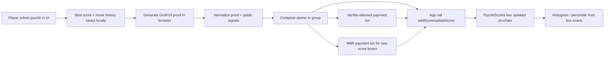

# Color Sort with Zero-Knowledge On-Chain Scores

A daily Color Sort puzzle game built with Vue + Vite, with optional Algorand wallet integration.

Players solve the puzzle locally, then submit a score on-chain with a Groth16 proof that the solution is valid, without revealing the move sequence.

## Highlights

- Daily puzzles seeded from Algorand block headers
- Deterministic 12-tube puzzle format (10 color tubes + 2 empty tubes)
- Local best-score tracking and move-history capture
- Zero-knowledge proof generation in the browser (`snarkjs`)
- Algorand smart contract score registry with per-user/per-puzzle score boxes
- On-chain score updates only when a new score is better (lower move count)

## Table of Contents

- [Game Rules](#game-rules)
- [How Scoring Works](#how-scoring-works)
- [Zero-Knowledge Flow](#zero-knowledge-flow)
- [On-Chain Contract Model](#on-chain-contract-model)
- [Architecture](#architecture)
- [Project Structure](#project-structure)
- [Getting Started](#getting-started)
- [Smart Contract Commands](#smart-contract-commands)
- [Testing](#testing)
- [Network Configuration](#network-configuration)
- [Security Notes](#security-notes)
- [FAQ](#faq)

## Game Rules

This implementation follows the standard Color Sort mechanics with precise constraints:

1. The board has 12 tubes, each with capacity 4.
2. Exactly 10 colors are used.
3. Each color appears exactly 4 times total.
4. Exactly 2 tubes are empty.
5. A move pours from one tube to another only if:
   - The source is not empty.
   - The destination is not full.
   - The destination top is either empty or the same color as the source top.
   - Source and destination are different tubes.
6. A legal pour moves the maximal contiguous top run of the same color (up to destination free space).
7. Puzzle is solved when every non-empty tube is fully monochrome.

### Puzzle Validity Constraints

Generated/validated puzzles must satisfy:

- Capacity >= 2
- At least 3 tubes (runtime game uses 12)
- Exactly 2 empty tubes
- Every used color appears exactly `capacity` times
- Solvable within solver limits (`maxNodes: 90000`, `maxDepth: 140` in validation)

## How Scoring Works

- Score = number of moves used in a successful solve.
- Lower score is better.
- Local best scores are stored in browser `localStorage` with the move history used to achieve that score.
- On-chain submission is available when:
  - A wallet is connected
  - The network has a configured `puzzleScoresAppId`
  - The candidate score is better than the user's recorded on-chain score (or no score exists yet)

## Zero-Knowledge Flow

The key idea: prove "I solved this specific puzzle in `N` moves" without publishing the private move sequence.

### Public vs Private Inputs

In the Circom circuit (`zk/color.circom`):

- Public input:
  - `initial` board state (flattened 12 \* 4)
- Public output:
  - `moveCount`
- Private inputs:
  - `srcs[NMOVES]`
  - `dsts[NMOVES]`
  - `active[NMOVES]` (prefix of 1s then 0s)

Current circuit profile:

- `NTUBES = 12`
- `CAP = 4`
- `NMOVES = 120`
- `NCOLORS = 10`
- `EMPTY_TUBES = 2`

### What the Circuit Enforces

1. Initial board is valid for this game profile.
2. Every active move is legal under game semantics.
3. State transition after each move is correct.
4. Final board is solved.
5. `moveCount` equals the number of active moves.

### Privacy Property

Because only the initial board and move count are public, observers can verify correctness without learning:

- The exact move path
- Intermediate board states
- The solver strategy

## On-Chain Contract Model

`contracts/PuzzleScores.algo.ts` stores one score per `(puzzleCode, user)` pair.

### Storage Layout

- Box key: `puzzleCode(20 bytes) + userAddress(32 bytes)` = 52 bytes
- Box value: `score` as uint64 big-endian (8 bytes)

### Methods

- `setVerifier(verifierAddress)`
  - Creator-only
  - Sets the authorized verifier account used for attestation txns
- `addScore(signals, proof, puzzleCode, score, payMbr, verifierTxn)`
  - Requires no existing score for sender+puzzle
  - Requires MBR payment from caller to app account
  - Requires verifier attestation txn from configured verifier
- `updateScore(signals, proof, puzzleCode, newScore, verifierTxn)`
  - Requires existing score
  - Requires `newScore < oldScore`
  - Requires verifier attestation txn
- `removeScore(puzzleCode)`
  - Deletes caller's score box
  - Refunds box MBR via inner payment
- `getMyScore(puzzleCode)` / `getScoreForUser(puzzleCode, user)`
  - Read-only score accessors

### Why a Verifier Transaction?

The app currently validates proof-linked public signals via a verifier-attested payment transaction in the same atomic group.

That verifier attestation acts as a gate proving that an authorized verifier accepted the Groth16 witness/signals corresponding to the claimed score and puzzle.

## Architecture



### Frontend Responsibilities

- Puzzle generation, interaction, and legality checks
- Local score persistence
- Proof generation with `snarkjs` + prebuilt wasm/zkey artifacts
- Wallet-based transaction signing and score upload
- Score comparison histogram based on on-chain entries

### Contract Responsibilities

- Immutable score semantics per user/puzzle
- Best-score-only updates
- Box MBR accounting
- Verifier-attestation gate checks

## Project Structure

- `src/game/`
  - Puzzle rules, generator, solver, serializer, validator
- `src/zk/`
  - Proof input encoding and proof/verify helpers
- `zk/`
  - Circom source and proving artifacts (`.wasm`, `.zkey`, verification key)
- `src/algorand/puzzleScores.ts`
  - Frontend on-chain interaction and score upload orchestration
- `contracts/PuzzleScores.algo.ts`
  - Algorand TypeScript smart contract
- `tests/contracts/PuzzleScores.algo.unit.test.ts`
  - Contract tests

## Getting Started

### Prerequisites

- Node.js (current LTS recommended)
- `pnpm`
- AlgoKit CLI (for compile/deploy workflows)

### Install

```bash
pnpm install
```

### Run Dev Server

```bash
pnpm dev
```

### Build

```bash
pnpm build
```

## Smart Contract Commands

Compile and generate typed client:

```bash
pnpm run build:contracts
```

Underlying scripts:

- `pnpm run compile:contracts`
- `pnpm run generate:client`

## Testing

Run all tests:

```bash
pnpm test:run
```

Run in watch mode:

```bash
pnpm test
```

Run contract tests only:

```bash
pnpm test:contracts
```

Run on-chain contract e2e tests against LocalNet:

```bash
algokit localnet start
pnpm test:contracts:e2e
```

## Network Configuration

Network settings are in `src/networks.json`.

- `mainnet`: indexer only by default (no app ID configured)
- `testnet`: has `puzzleScoresAppId`
- `localnet`: has `puzzleScoresAppId`

If `puzzleScoresAppId` is missing for a network, on-chain score upload is unavailable there.

## Security Notes

- The circuit and app both encode puzzle identity and score constraints, but in different layers:
  - Circuit: validates move semantics and solved final state
  - Contract: enforces score ownership, monotonic improvement, and attested verification gating
- Box MBR is strictly accounted for when creating/removing score entries.
- Score uploads are grouped atomically to avoid partial state transitions.

## FAQ

### Does this reveal my moves?

No. The move sequence is private circuit input. Only public signals required for verification are exposed.

### What is actually stored on-chain?

Only your best score for a specific encoded puzzle, keyed by `(puzzleCode, address)`.

### Why is my score button disabled?

Typical reasons:

- Wallet not connected
- Proof still generating
- Network has no configured `puzzleScoresAppId`
- Your on-chain score is already as good or better

### Can I submit multiple times?

You can update only with a strictly better score (fewer moves). Equal or worse scores are skipped.

---

If you are extending this project, start with:

1. `src/game/` for gameplay changes
2. `zk/color.circom` for proof constraints
3. `contracts/PuzzleScores.algo.ts` for on-chain policy
