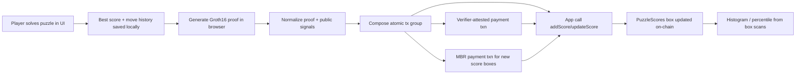

# Color Sort with Zero-Knowledge On-Chain Scores

A daily Color Sort puzzle game built with Vue + Vite, with optional Algorand wallet integration.

Players solve the puzzle locally, then submit a score on-chain with a Groth16 proof that the solution is valid, without revealing the move sequence.

## Highlights

- Daily puzzles seeded from Algorand block headers
- Deterministic 12-tube puzzle format (10 color tubes + 2 empty tubes)
- Local best-score tracking and move-history capture
- Zero-knowledge proof generation in the browser (`snarkjs`)
- Algorand smart contract score registry with per-user/per-puzzle score boxes
- On-chain score updates only when a new score is better (lower move count)

## Table of Contents

- [Game Rules](#game-rules)
- [How Scoring Works](#how-scoring-works)
- [Zero-Knowledge Flow](#zero-knowledge-flow)
- [On-Chain Contract Model](#on-chain-contract-model)
- [Architecture](#architecture)
- [Project Structure](#project-structure)
- [Getting Started](#getting-started)
- [Smart Contract Commands](#smart-contract-commands)
- [Testing](#testing)
- [Network Configuration](#network-configuration)
- [Security Notes](#security-notes)
- [FAQ](#faq)

## Game Rules

This implementation follows the standard Color Sort mechanics with precise constraints:

1. The board has 12 tubes, each with capacity 4.
2. Exactly 10 colors are used.
3. Each color appears exactly 4 times total.
4. Exactly 2 tubes are empty.
5. A move pours from one tube to another only if:
   - The source is not empty.
   - The destination is not full.
   - The destination top is either empty or the same color as the source top.
   - Source and destination are different tubes.
6. A legal pour moves the maximal contiguous top run of the same color (up to destination free space).
7. Puzzle is solved when every non-empty tube is fully monochrome.

### Puzzle Validity Constraints

Generated/validated puzzles must satisfy:

- Capacity >= 2
- At least 3 tubes (runtime game uses 12)
- Exactly 2 empty tubes
- Every used color appears exactly `capacity` times
- Solvable within solver limits (`maxNodes: 90000`, `maxDepth: 140` in validation)

## How Scoring Works

- Score = number of moves used in a successful solve.
- Lower score is better.
- Local best scores are stored in browser `localStorage` with the move history used to achieve that score.
- On-chain submission is available when:
  - A wallet is connected
  - The network has a configured `puzzleScoresAppId`
  - The candidate score is better than the user's recorded on-chain score (or no score exists yet)

## Zero-Knowledge Flow

The key idea: prove "I solved this specific puzzle in `N` moves" without publishing the private move sequence.

### Public vs Private Inputs

In the Circom circuit (`zk/color.circom`):

- Public input:
  - `initial` board state (flattened 12 \* 4)
- Public output:
  - `moveCount`
- Private inputs:
  - `srcs[NMOVES]`
  - `dsts[NMOVES]`
  - `active[NMOVES]` (prefix of 1s then 0s)

Current circuit profile:

- `NTUBES = 12`
- `CAP = 4`
- `NMOVES = 120`
- `NCOLORS = 10`
- `EMPTY_TUBES = 2`

### What the Circuit Enforces

1. Initial board is valid for this game profile.
2. Every active move is legal under game semantics.
3. State transition after each move is correct.
4. Final board is solved.
5. `moveCount` equals the number of active moves.

### Privacy Property

Because only the initial board and move count are public, observers can verify correctness without learning:

- The exact move path
- Intermediate board states
- The solver strategy

## On-Chain Contract Model

`contracts/PuzzleScores.algo.ts` stores one score per `(puzzleCode, user)` pair.

### Storage Layout

- Box key: `puzzleCode(20 bytes) + userAddress(32 bytes)` = 52 bytes
- Box value: `score` as uint64 big-endian (8 bytes)

### Methods

- `setVerifier(verifierAddress)`
  - Creator-only
  - Sets the authorized verifier account used for attestation txns
- `addScore(signals, proof, puzzleCode, score, payMbr, verifierTxn)`
  - Requires no existing score for sender+puzzle
  - Requires MBR payment from caller to app account
  - Requires verifier attestation txn from configured verifier
- `updateScore(signals, proof, puzzleCode, newScore, verifierTxn)`
  - Requires existing score
  - Requires `newScore < oldScore`
  - Requires verifier attestation txn
- `removeScore(puzzleCode)`
  - Deletes caller's score box
  - Refunds box MBR via inner payment
- `getMyScore(puzzleCode)` / `getScoreForUser(puzzleCode, user)`
  - Read-only score accessors

### Why a Verifier Transaction?

The app currently validates proof-linked public signals via a verifier-attested payment transaction in the same atomic group.

That verifier attestation acts as a gate proving that an authorized verifier accepted the Groth16 witness/signals corresponding to the claimed score and puzzle.

## Architecture


```mermaid
flowchart LR
  A[Player solves puzzle in UI] --> B[Best score + move history saved locally]
  B --> C[Generate Groth16 proof in browser]
  C --> D[Normalize proof + public signals]
  D --> E[Compose atomic tx group]
  E --> F[Verifier-attested payment txn]
  E --> G[MBR payment txn for new score boxes]
  E --> H[App call addScore/updateScore]
  F --> H
  G --> H
  H --> I[PuzzleScores box updated on-chain]
  I --> J[Histogram / percentile from box scans]
```

### Frontend Responsibilities

- Puzzle generation, interaction, and legality checks
- Local score persistence
- Proof generation with `snarkjs` + prebuilt wasm/zkey artifacts
- Wallet-based transaction signing and score upload
- Score comparison histogram based on on-chain entries

### Contract Responsibilities

- Immutable score semantics per user/puzzle
- Best-score-only updates
- Box MBR accounting
- Verifier-attestation gate checks

## Project Structure

- `src/game/`
  - Puzzle rules, generator, solver, serializer, validator
- `src/zk/`
  - Proof input encoding and proof/verify helpers
- `zk/`
  - Circom source and proving artifacts (`.wasm`, `.zkey`, verification key)
- `src/algorand/puzzleScores.ts`
  - Frontend on-chain interaction and score upload orchestration
- `contracts/PuzzleScores.algo.ts`
  - Algorand TypeScript smart contract
- `src/algorand/scoreGroups.ts`
  - Environment-neutral witness/box/group helpers shared by the app, the
    Netlify functions, and the tests
- `src/discord/`
  - Discord Activity integration (proxy mappings, OAuth handshake)
- `netlify/functions/`
  - Discord token exchange, sponsored submit, and the daily sweep
- `contracts/tests/PuzzleScores.algo.unit.test.ts`
  - Contract tests

## Getting Started

### Prerequisites

- Node.js (current LTS recommended)
- `pnpm`
- AlgoKit CLI (for compile/deploy workflows)

### Install

```bash
pnpm install
```

### Run Dev Server

```bash
pnpm dev
```

### Build

```bash
pnpm build
```

## Smart Contract Commands

Compile and generate typed client:

```bash
pnpm run build:contracts
```

Underlying scripts:

- `pnpm run compile:contracts`
- `pnpm run generate:client`

## Testing

Run all tests:

```bash
pnpm test:run
```

Run in watch mode:

```bash
pnpm test
```

Run contract tests only:

```bash
pnpm test:contracts
```

Run on-chain contract e2e tests against LocalNet:

```bash
algokit localnet start
pnpm test:contracts:e2e
```

## Discord Activity and Sponsored Scores

The same build runs as a [Discord Activity](https://discord.com/developers/docs/activities/overview)
(the app inside Discord's iframe). Activity mode is detected from the `frame_id`
query parameter Discord adds; outside Discord nothing changes.

Inside Discord there is **no wallet connect**. Instead:

- The proof is still generated in the player's browser, but bound to
  `sha256("discord:" + userId)` instead of a wallet address.
- A Netlify function (`netlify/functions/submit-sponsored.ts`) verifies the
  Discord identity and submits the score from a **sponsor account**, paying the
  group fees. Box MBR comes from the app account.
- Only **today's daily puzzle** is sponsored. A scheduled function
  (`netlify/functions/sweep-sponsored.ts`) deletes sponsored score boxes the
  next day, releasing their MBR back to the app account.
- "Keep permanently with a wallet" opens the website in the external browser
  with the puzzle and move list in the URL (`?moves=3:7,1:11,...`); the
  website verifies the moves solve the puzzle, records the best score locally,
  and the normal wallet flow takes over.

### Contract additions

- `setSponsor(address)` (creator-only) and globals `sponsor`,
  `sponsoredPuzzle`, `sponsoredCount`.
- `addSponsoredScore` / `updateSponsoredScore(signals, proof, puzzleCode, userKey, score, verifierTxn)`:
  sponsor-only; the proof's identity limbs must equal the 32-byte `userKey`.
- Sponsored boxes: key `"s" + puzzleCode(20) + userKey(32)`, value
  `score(1) + updates(1)`.
- Caps that hold even if the sponsor key leaks: at most 8 updates per user key
  per puzzle, and at most 1,000 sponsored boxes per puzzle code.
- `sweepSponsoredScores(puzzleCode, userKeys[])` (sponsor-only) deletes boxes;
  missing keys are ignored so the sweep is idempotent.
- `getSponsoredScore(puzzleCode, userKey)` read-only accessor.

### Abuse limits

Failed groups are never included in a block, so they cost nothing; a drain
needs valid proofs. Layers: Netlify per-IP rate limits declared in each
function, Discord account age (snowflake timestamp), "today's puzzle only",
the contract caps above, and small hand-topped-up floats (sponsor fee float,
app-account MBR float) as the hard ceiling.

### Configuration

Copy `.env.example`. Build-time (Vite): `VITE_DISCORD_CLIENT_ID`,
`VITE_SITE_URL`. Function runtime (Netlify env, mark secrets as secret):
`DISCORD_CLIENT_ID`, `DISCORD_CLIENT_SECRET`, `DISCORD_PUBLIC_KEY`, `SPONSOR_MNEMONIC`,
`SPONSOR_MIN_BALANCE`, `MIN_DISCORD_ACCOUNT_AGE_DAYS`, `ALGORAND_NETWORK`, and
optional `PUZZLE_SCORES_APP_ID` / `ALGOD_URL` overrides.

Discord developer portal:

- Activity URL mapping `/` → the Netlify site.
- Proxy mappings for the Algorand hosts the app talks to (see
  `DISCORD_PROXY_MAPPINGS` in `src/discord/activity.ts`): `/algod` →
  `mainnet-api.algonode.cloud`, `/algod-nodely` → `mainnet-api.4160.nodely.dev`,
  `/idx` → `mainnet-idx.algonode.cloud`, `/idx-nodely` →
  `mainnet-idx.4160.nodely.dev`.
- OAuth2 redirect is not needed; the Embedded App SDK handles the code flow
  and `netlify/functions/discord-token.ts` exchanges it.

### Sharing scores and the slash commands

- **Share score to a channel** (Scores panel, Activity only) calls the SDK's
  `shareInteraction`: the message is posted as the player having run
  `/colorsort`, with the score text from `src/discord/share.ts` and a
  "Play today's puzzle" button. `shareInteraction` is in the SDK but not yet
  in Discord's public reference; if the client rejects it the app falls back
  to `shareLink`, which posts the same text with an Activity launch link.
- **`/colorsort`** and the button are handled by
  `netlify/functions/discord-interactions.ts` (routed from
  `/api/discord-interactions`). It verifies Discord's Ed25519 signature with
  `DISCORD_PUBLIC_KEY`, answers the PING check, and responds with
  `LAUNCH_ACTIVITY`, which opens the Activity for the user who invoked it.
- **`/score [user]`** posts the invoking user's (or the picked user's)
  recorded score for today's daily puzzle to the channel, with the same
  "better than X%" line as the Activity and the play button. The lookup is
  by the sponsored identity `sha256("discord:" + userId)`, so only scores
  submitted from the Activity are found; a wallet score is not tied to a
  Discord account. The mention renders without pinging. No score, or an
  empty board, gets a private reply instead.
- **`/graph`** posts today's score distribution (wallet and sponsored
  scores together) as a text bar chart, one row per recorded move count,
  with the play button.
- Both commands read the chain synchronously: today's puzzle code comes from
  the block seed (cached per day per function instance) and the scores from
  algod box listings, in `netlify/functions/lib/scoreboard.ts`. The read is
  capped at 2.2 s so the reply always lands inside Discord's 3-second
  deadline; a slow chain gets a private "try again" instead of Discord's
  "did not respond". Deferred replies are not an option here: the free plan
  has no background functions and the function runtime cannot keep working
  after the response is sent.

Setup, once:

1. Developer portal → General Information: copy **Public Key** into the
   `DISCORD_PUBLIC_KEY` Netlify env var and deploy.
2. Set **Interactions Endpoint URL** to
   `https://<site>/api/discord-interactions`. Discord sends a signed PING and
   only saves the URL when it gets `{"type":1}` back.
3. Register the commands with the bot token from the portal's Bot page (local
   only, never a Netlify var):

   ```bash
   DISCORD_BOT_TOKEN=... pnpm run discord:register-commands
   ```

   The script uses a per-command POST, which upserts by name. Do not bulk
   overwrite (PUT) commands: that also removes the Entry Point command Discord
   created for the Activity, which stays on the "Discord launches Activity"
   handler and needs no endpoint. Global commands can take up to an hour to
   show in clients.

### Terms of Service and Privacy Policy

Discord requires both URLs on the app's General Information page. They are
served at `/terms` and `/privacy` (`src/components/TermsPage.vue`,
`src/components/PrivacyPage.vue`) and written in plain language for a free
daily game. Both link to the repo's GitHub Issues as the way to report
problems and request data changes, which Discord's Developer Policy requires;
mention the same link in the app's portal description.

### Verification key for the functions

The functions build the Groth16 verifier LogicSig from
`netlify/functions/lib/verification_key.bn254.json` instead of the 52 MiB
zkey. Regenerate it whenever the zkey changes:

```bash
pnpm run export:vk
```

### Deploying the contract upgrade

Adding the sponsor globals grows the global schema (ints 1, bytes 3).
`contracts/deploy-config.ts` updates an existing app in place with an update
transaction that carries the new schema (`updateAppInPlace`), which the
network allows since AVM 13. The extra global-state MBR (128,500 µALGO) is
charged to the **creator** account, so fund the creator first. The script then
tops up the app account (`SPONSOR_MBR_FLOAT_ALGO`, default 1) and calls
`setSponsor` with the `SPONSOR_MNEMONIC` account.

### Local testing

```bash
algokit localnet start
pnpm test:contracts:e2e      # includes the sponsored paths and the schema upgrade
pnpm run test:functions:e2e  # submit + sweep functions against LocalNet (Discord mocked)
pnpm run typecheck:functions
```

## Network Configuration

Network settings are in `src/networks.json`.

- `mainnet`: indexer only by default (no app ID configured)
- `testnet`: has `puzzleScoresAppId`
- `localnet`: has `puzzleScoresAppId`

If `puzzleScoresAppId` is missing for a network, on-chain score upload is unavailable there.

## Security Notes

- The circuit and app both encode puzzle identity and score constraints, but in different layers:
  - Circuit: validates move semantics and solved final state
  - Contract: enforces score ownership, monotonic improvement, and attested verification gating
- Box MBR is strictly accounted for when creating/removing score entries.
- Score uploads are grouped atomically to avoid partial state transitions.

## FAQ

### Does this reveal my moves?

No. The move sequence is private circuit input. Only public signals required for verification are exposed.

### What is actually stored on-chain?

Only your best score for a specific encoded puzzle, keyed by `(puzzleCode, address)`.

### Why is my score button disabled?

Typical reasons:

- Wallet not connected
- Proof still generating
- Network has no configured `puzzleScoresAppId`
- Your on-chain score is already as good or better

### Can I submit multiple times?

You can update only with a strictly better score (fewer moves). Equal or worse scores are skipped.

---

If you are extending this project, start with:

1. `src/game/` for gameplay changes
2. `zk/color.circom` for proof constraints
3. `contracts/PuzzleScores.algo.ts` for on-chain policy
